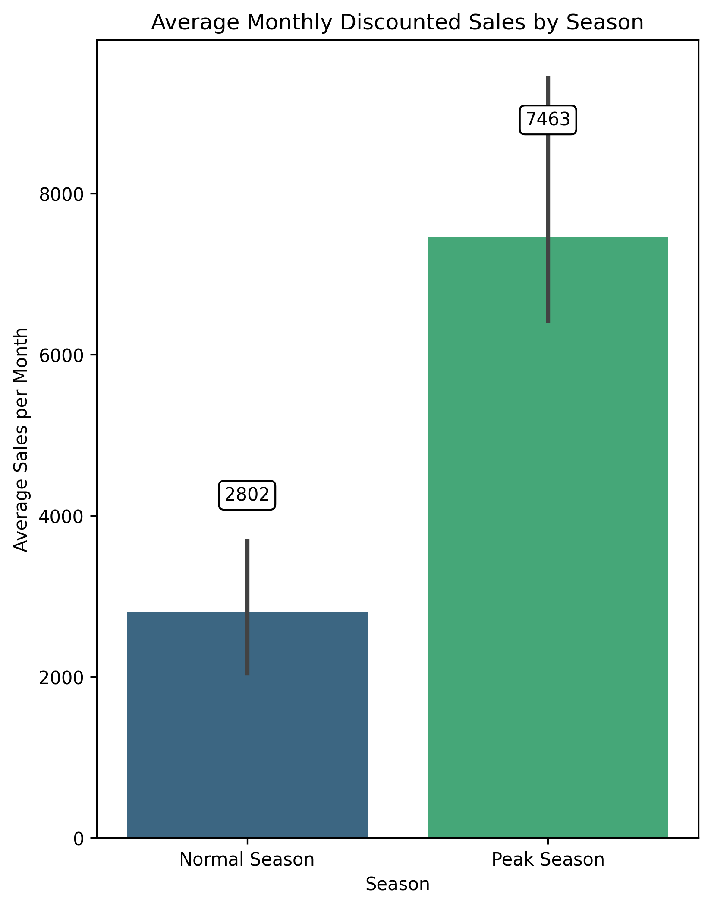
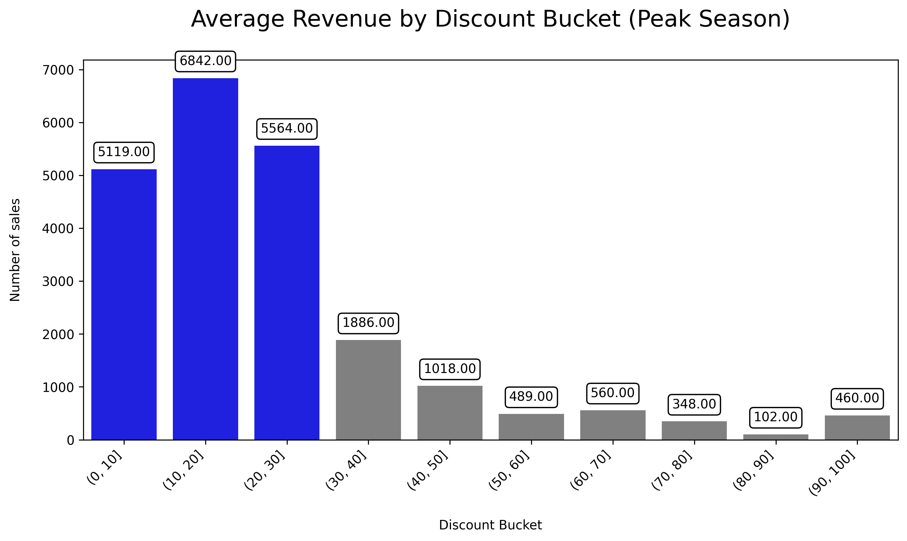

# E-Commerce Discount Strategy Analysis

<p align="center">


</p>

<p align="center">

<a href="https://github.com/Mustafa-Al-Hamoud/ecommerce_discount_analysis/blob/main/notebook/04_Business_Analysis.ipynb">

</a>

<a href="https://github.com/Mustafa-Al-Hamoud/ecommerce_discount_analysis/blob/main/presentation/Die_Rabattstrategie_von_ENIAC.pptx">

</a>

</p>

---

# Project Overview

This project analyzes the impact of discount strategies on sales performance in an e-commerce environment. The analysis focuses on understanding how different discount levels influence revenue, sales volume, and customer purchasing behavior during both **Normal Season** and **Peak Season**.

This project analyzes sales data from (**Eniac**) as part of a data analytics training project. The objective is to explore discount strategies and generate business insights based on the available dataset.
This project demonstrates the complete workflow of a data analysis project, starting from raw data cleaning and quality assessment to exploratory analysis, visualization, and business recommendations.

---

# Business Problem

E-commerce companies frequently use discounts to increase sales, but excessive discounts may reduce profitability while insufficient discounts may fail to attract customers.

The main challenge is finding a discount strategy that balances:

- Revenue growth
- Sales volume
- Customer demand
- Business profitability

This project aims to identify the discount levels that provide the best business outcomes while comparing customer behavior between Normal Season and Peak Season.

---

# Business Objectives

The project answers the following business questions:

- How do discounts affect revenue?
- Which discount levels perform best?
- Does Peak Season change customer behavior?
- Which products generate the highest revenue?
- Which discount strategy should an e-commerce company adopt?

---

# Key Findings

The analysis revealed several important insights:

- Moderate discounts achieved the best balance between revenue and sales volume.
- Peak Season generated substantially higher sales activity than Normal Season.
- Higher discounts did not always produce higher revenue.
- Customer purchasing behavior differed significantly between Peak Season and Normal Season.
- A structured data cleaning process improved the reliability of the business analysis.

---

# Project Workflow

The project followed a complete data analytics workflow:

```
Raw Data
      │
      ▼
Data Cleaning
      │
      ▼
Data Quality Assessment
      │
      ▼
Product Categorization
      │
      ▼
Business Analysis
      │
      ▼
Data Visualization
      │
      ▼
Business Recommendations
```

---

# Repository Structure

```
ecommerce_discount_analysis/

│
├── data/
│   ├── original_data/
│   ├── cleaned/
│   ├── data_quality/
│   └── final/
│
├── images/
│
├── notebook/
│   ├── 01_Data_Cleaning.ipynb
│   ├── 02_Data_Quality_Assessment.ipynb
│   ├── 03_Product_Categorization.ipynb
│   └── 04_Business_Analysis.ipynb
│
├── presentation/
│
├── README.md
│
└── .gitignore
```

---

# Project Files

## 01_Data_Cleaning.ipynb

This notebook focuses on preparing the raw dataset for analysis by:

- Handling missing values
- Removing duplicates
- Correcting inconsistent data types
- Cleaning price information
- Standardizing the dataset

---

## 02_Data_Quality_Assessment.ipynb

This notebook evaluates the quality of the cleaned dataset.

Main tasks include:

- Missing value analysis
- Duplicate detection
- Data consistency checks
- Data validation
- Quality reporting

---

## 03_Product_Categorization.ipynb

This notebook creates meaningful product categories by classifying products based on their descriptions.

The categorization improves later business analysis and visualization.

---

## 04_Business_Analysis.ipynb

This notebook contains the complete business analysis including:

- Exploratory Data Analysis (EDA)
- Revenue analysis
- Discount analysis
- Peak Season analysis
- Customer purchasing behavior
- Business recommendations

---

# Peak Season Definition

For this project:

**Peak Season** refers to periods with significantly increased customer demand and higher sales activity.

Comparisons throughout this analysis are made between:

- Normal Season
- Peak Season

to evaluate how customer behavior changes under different business conditions.

---

# Visualizations

## Revenue Performance

**Business Question**

How do discounts and seasonality influence revenue performance?

<p align="center">





</p>

### Key Insights

- Discounted products generated higher average revenue per order than non-discounted products.
- Monthly discounted sales fluctuated throughout the year, revealing seasonal purchasing patterns.
- Peak Season generated considerably higher revenue than the Normal Season, indicating increased customer demand.

---

## Discount Performance During Normal Season

**Business Question**

Which discount levels achieve the best business performance during the Normal Season?

<p align="center">


</p>

### Key Insights

- Moderate discounts generated a strong balance between revenue and sales volume.
- Very high discounts did not consistently improve business performance.
- Customer demand increased with discounts, but revenue gains eventually leveled off.

---

## Discount Performance During Peak Season

**Business Question**

How does customer behavior change during Peak Season?

<p align="center">




</p>

### Key Insights

- Peak Season amplified customer demand across almost all discount levels.
- Moderate discounts remained highly effective.
- Large discounts were not always necessary to achieve strong sales performance.

---

## Top Revenue-Generating Products

**Business Question**

Which products generated the highest revenue during Peak Season?

<p align="center">


</p>

### Key Insight

The visualization identifies the products contributing the highest revenue during Peak Season. These products should receive greater attention in future promotional campaigns and inventory planning.

---

# Business Recommendations

Based on the analysis, the following recommendations are suggested:

### 1. Focus on Moderate Discounts

Moderate discounts consistently achieved a strong balance between customer demand and revenue generation.

---

### 2. Maximize Peak Season Opportunities

Peak Season generated the highest customer activity.

Marketing campaigns should therefore prioritize these periods.

---

### 3. Avoid Excessive Discounts

Large discounts did not consistently improve business performance and may reduce profitability.

---

### 4. Prioritize High-Revenue Products

Products generating the highest revenue should receive greater inventory availability and marketing support.

---

### 5. Continue Monitoring Customer Behavior

Customer purchasing patterns change over time.

Regular analysis helps optimize future pricing strategies.

---

# Technologies

This project was completed using:

- Python
- Pandas
- Matplotlib
- Jupyter Notebook
- GitHub

---

# Skills Demonstrated

Throughout this project, the following data analytics skills were applied:

- Data Cleaning
- Data Validation
- Data Quality Assessment
- Exploratory Data Analysis (EDA)
- Business Analysis
- Data Visualization
- Business Storytelling
- Business Recommendations
- GitHub Documentation

---

# Future Improvements

Potential future enhancements include:

- Build an interactive Power BI dashboard.
- Create a Tableau dashboard.
- Apply predictive machine learning models.
- Perform customer segmentation.
- Forecast future sales.
- Analyze customer lifetime value.

---

# Project Highlights

✔ End-to-end data analytics workflow

✔ Business-focused analysis

✔ Data quality assessment

✔ Professional documentation

✔ Business recommendations

✔ GitHub portfolio project

---

# Author

**Mustafa Al Hamoud**

IT Engineer | Data Analytics Enthusiast

GitHub: https://github.com/Mustafa-Al-Hamoud

---

## Acknowledgements

This project analyzes sales data from (**Eniac**) as part of a data analytics training project. The objective is to explore discount strategies 
and generate business insights based on the available dataset.

---

⭐ **If you found this project interesting, feel free to give it a star on GitHub!**


The following charts summarize the key business insights generated during the analysis.
